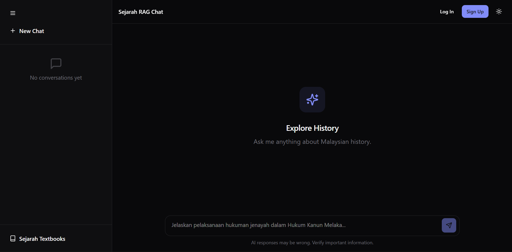

<!--
title: Sejarah RAG
tags:
  [
    RAG,
    Next.js,
    FastAPI,
    NextAuth,
    PostgreSQL,
    pgvector,
    LangChain,
    Educational,
    AI Chatbot,
  ]
description: A full-stack educational web app for learning Malaysian History (Sejarah) using an AI-powered RAG chatbot with textbook citations, Next.js frontend, and FastAPI backend.
-->

# Sejarah RAG

## Overview

Sejarah RAG is a full-stack educational web application designed to help students learn Malaysian History (Sejarah) through an interactive, AI-powered chatbot. Leveraging **Retrieval-Augmented Generation (RAG)**, the application retrieves relevant historical facts and context from vectorized Sejarah textbooks to synthesize accurate, cited answers to user queries.

In addition to its AI chatbot capabilities, the platform provides a virtual bookshelf for browsing and reading history textbooks directly within the app, comprehensive session history management, and secure user authentication. The architecture combines a robust Next.js frontend with a fast, specialized FastAPI backend dedicated exclusively to vector operations and LLM generation. The AI intelligence is powered by state-of-the-art open-weight models: high-dimensional vector embeddings are generated using [`Alibaba-NLP/gte-Qwen2-1.5B-instruct`](https://huggingface.co/Alibaba-NLP/gte-Qwen2-1.5B-instruct) (1536d) from HuggingFace, while deep contextual reasoning and conversational outputs are handled by fast foundational LLMs such as `meta-llama/llama-4-scout-17b-16e-instruct` (via Groq) or `xiaomi/mimo-v2-flash:free` (via OpenRouter).

## Key Features

- **AI-Powered Virtual Tutor**: An intelligent chat interface that answers questions about Malaysian History, equipped with a simulated real-time typewriter effect.
- **Fact Verification & Citations**: Every AI response includes citations referencing the source textbook material, ensuring answers are grounded in the curriculum.
- **Persistent Chat History**: Authenticated users benefit from persistent chat history stored securely in a PostgreSQL database via Server Actions, while guest users can engage in volatile single-session interactions.
- **Virtual Textbook Library**: A responsive digital bookshelf allowing users to browse, select, and read PDF history textbooks through an integrated full-screen viewer.
- **Secure Authentication System**: Comprehensive user authentication using NextAuth.js v5, offering seamless Email/Password and Google OAuth login options.
- **Modern UI/UX**: Built with Tailwind CSS v4 and Shadcn UI components mapping to custom design tokens, rendering beautiful Light and Dark themes.

## Tech Stack

### Frontend

- **Framework:** Next.js 15 (App Router, Server Actions)
- **UI Library:** React 19, Shadcn UI, Radix UI Primitives, Lucide React
- **Styling:** Tailwind CSS v4, Class Variance Authority
- **Database ORM:** Prisma ORM 7 (`@prisma/adapter-pg`)
- **Authentication:** NextAuth.js v5 (Auth.js)
- **Validation:** Zod, React Hook Form

### Backend

- **Framework:** FastAPI, Uvicorn (Python 3.12+)
- **AI/RAG Pipeline:** LangChain Core, OpenRouter, Groq
- **Embeddings:** Sentence Transformers, PyTorch
- **Vector Storage:** Supabase (PostgreSQL `pgvector`)
- **Dependency Management:** `uv`
- **Other Utilities:** Llama.cpp, Pydantic

## Getting Started

### Demonstration

Checkout: https://sejarah-rag-website.vercel.app

## License

This project is licensed under the MIT License. See the `LICENSE` file for more details.
